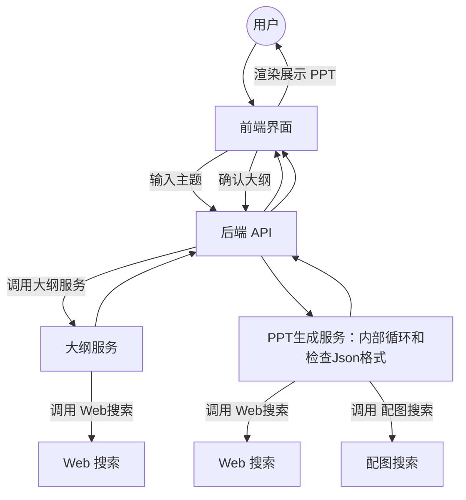

# TrainPPTAgent

**TrainPPTAgent** 是一款基于 AI 的智能演示文稿生成工具。用户只需输入主题，系统即可自动生成结构完整、内容丰富的 PPT 大纲与逐页内容。项目采用 **前后端分离架构**：前端负责交互、大纲编辑与模板选择，后端则借助大语言模型（LLM）与强化学习（GRPO）完成内容生成与优化，使生成的 PPT 更贴合用户目标。

English：[README_EN.md](README_EN.md)

强化学习训练代码请参见另外项目：
👉 [PPT 模型训练代码](https://github.com/johnson7788/RLTrainPPT)

---

## ✨ 功能特性

* **智能大纲生成**
  输入主题后，自动生成逻辑清晰、结构合理的演示文稿大纲。

* **逐页内容生成**
  采用流式传输技术，实现 PPT 内容的实时生成与展示，提升交互体验。

* **用户已有大纲或者文件上传到知识库**
  根据知识库的内容生成PPT。

* **模板支持**
  提供多种模板供用户选择，支持内容与样式的分离式填充。

* **前后端分离架构**
  前端使用 **Vue.js + Vite + TypeScript**，后端基于 **Python (Flask/FastAPI)**，架构清晰、可扩展性强。

* **强化学习驱动**
  引入 **GRPO 强化学习方法**，优化 PPT Agent 的生成效果，使结果更符合用户需求。

---

## 🛠 技术栈

* **前端**: Vue.js, Vite, TypeScript
* **后端**: Python, Flask/FastAPI, A2A, ADK, MCP 搜索
* **AI 模型**: 大语言模型（用于大纲与内容生成）

---

## 📋 项目结构

```
TrainPPTAgent/
├── backend/           # 后端代码
│   ├── main_api/      # 核心 API 服务
│   ├── slide_agent/   # AI Agent 逻辑
│   └── ...
├── frontend/          # 前端代码
│   ├── src/
│   │   ├── views/     # 页面组件（大纲、编辑等）
│   │   ├── services/  # API 调用服务
│   │   └── ...
│   └── vite.config.ts # 前端配置
└── doc/               # 项目文档
    ├── API_*.md       # API 接口文档
    └── ...
```

---

## 🚀 快速开始

### 后端服务

#### 方法一：一键启动（推荐）

使用我们提供的启动脚本，可以一键启动所有后端服务：

```bash
cd backend
pip install -r requirements.txt
python start_backend.py
```

**功能特性：**
- ✅ 自动检查Python版本和依赖
- ✅ 自动安装所需包
- ✅ 端口占用检测和清理（需要用户确认）
- ✅ 自动设置环境文件
- ✅ 多进程管理和监控

#### 方法二：手动启动

1. 进入后端目录：

   ```bash
   cd backend
   ```
2. 安装依赖：

   ```bash
   pip install -r requirements.txt
   ```
3. 启动主 API 服务（默认运行在 `http://127.0.0.1:6800`）：

   ```bash
   cd main_api
   cp env_template .env
   python main.py
   ```
4. 启动大纲生成服务（默认运行在 `http://127.0.0.1:10001`）：

   ```bash
   cd backend/simpleOutline
   cp env_template .env   #复制完成后，修改.env文件
   python main_api.py
   ```
5. 启动 PPT 内容生成服务（默认运行在 `http://127.0.0.1:10011`）：

   ```bash
   cd backend/slide_agent
   cp env_template .env  #复制完成后，修改.env文件
   修改每个Agent的模型
   backend/slide_agent/slide_agent/config.py
   python main_api.py
   ```

> **详细说明：** 请参考 [backend/启动说明.md](backend/启动说明.md)

### 前端服务

1. 进入前端目录：

   ```bash
   cd frontend
   ```
2. 安装依赖：

   ```bash
   npm install
   ```
3. 启动开发服务器（默认运行在 `http://127.0.0.1:5173`）：

   ```bash
   npm run dev
   ```

> **提示**: 前端通过 Vite 代理与后端 API 通信，具体配置请查看 `frontend/vite.config.ts`。

#### 方法三：docker compose一键部署(确保能连接docker hub网络)
docker compose up 

---

## 🤖 AI 生成流程

1. **输入主题** → 用户在前端输入主题
2. **生成大纲** → 调用 `/api/tools/aippt_outline`，生成 Markdown 格式的大纲
3. **生成内容** → 调用 `/api/tools/aippt`，结合模板逐页生成内容
4. **实时渲染** → 前端渲染并展示完整 PPT

---

## 📑 流程图

PPTGen：可以扩展为更多功能的Agent，例如检查质量（图表等)


---

## 🖼 界面示意

* **大纲生成**
  

* **模板选择**
  

* **逐页生成 PPT**
  

---

## 📌 待办事项
* [ ] 表格的支持
* [ ] 支持上传自定义 PPT 模板并自动标注

---

## 📖 文档与参考

* [更新日志](doc/CHANGES.md)
* [自定义模板说明](doc/Template.md)
* 前端引用项目（本项目免版权，但前端部分需注意版权）：
  [https://github.com/pipipi-pikachu/PPTist](https://github.com/pipipi-pikachu/PPTist)
* [模版制作](doc/Template.md)
* [不同的模型配置](doc/custom_model.md)
---

## 📬 联系方式

如有问题，请联系作者：


---
