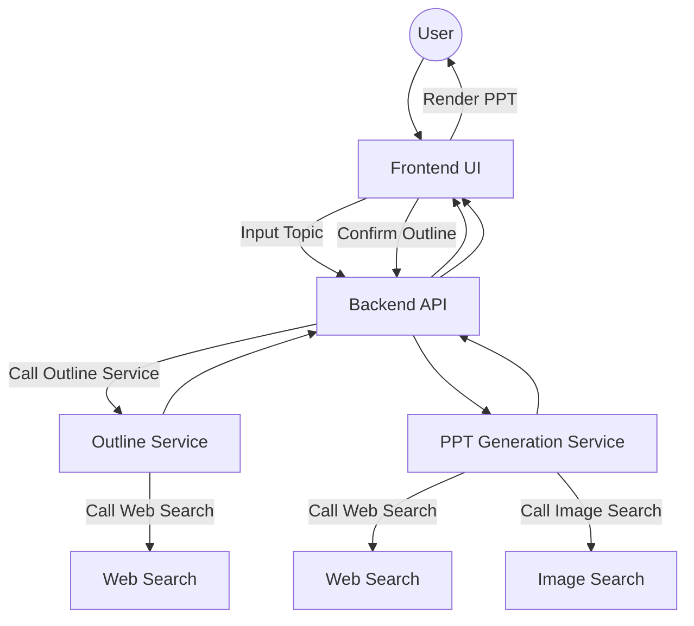

# TrainPPTAgent

**TrainPPTAgent** is an AI-powered tool for automatically generating professional presentation slides (PPT). With just a topic as input, the system generates a well-structured outline and slide contents.

The project adopts a **frontend-backend decoupled architecture**:

* **Frontend** handles user interaction, outline editing, and template selection.
* **Backend** leverages large language models (LLMs) and reinforcement learning (GRPO) to generate optimized PPT outlines and content aligned with user goals.

---

## ✨ Features

* **AI-Powered Outline Generation**
  Automatically generates a logically structured presentation outline from a topic.

* **Page-by-Page Content Generation**
  Supports streaming content generation, allowing slides to be displayed incrementally in real-time.

* **Template Support**
  Provides multiple templates so users can apply content to different styles flexibly.

* **Decoupled Architecture**
  Built with **Vue.js + Vite + TypeScript** for the frontend and **Python (Flask/FastAPI)** for the backend.

* **Reinforcement Learning Optimization**
  Powered by **GRPO reinforcement learning**, making the slide agent outputs more relevant to the user’s objectives.

---

## 🛠 Tech Stack

* **Frontend**: Vue.js, Vite, TypeScript
* **Backend**: Python, Flask/FastAPI, A2A, ADK, MCP Search
* **AI Models**: Large language models for outline and content generation

Related training code:
👉 [PPT Model Training Repository](https://github.com/johnson7788/RLTrainPPT)

---

## 📂 Project Structure

```
TrainPPTAgent/
├── backend/           # Backend code
│   ├── main_api/      # Core API services
│   ├── slide_agent/   # AI Agent logic
│   └── ...
├── frontend/          # Frontend code
│   ├── src/
│   │   ├── views/     # Page components (outline, PPT editing, etc.)
│   │   ├── services/  # API service layer
│   │   └── ...
│   └── vite.config.ts # Frontend config
└── doc/               # Documentation
    ├── API_*.md       # API specs
    └── ...
```

---

## 🚀 Getting Started

### Backend

1. Navigate to the backend directory:

   ```bash
   cd backend
   ```
2. Install dependencies:

   ```bash
   pip install -r requirements.txt
   ```
3. Start the main API service (default: `http://127.0.0.1:6800`):

   ```bash
   cd main_api
   cp env_template .env
   python main.py
   ```
4. Start the outline service (default: `http://127.0.0.1:10001`):

   ```bash
   cd backend/simpleOutline
   cp env_template .env
   python main_api.py
   ```
5. Start the PPT content service (default: `http://127.0.0.1:10011`):

   ```bash
   cd backend/slide_agent
   cp env_template .env
   python main_api.py
   ```

### Frontend

1. Navigate to the frontend directory:

   ```bash
   cd frontend
   ```
2. Install dependencies:

   ```bash
   npm install
   ```
3. Start the development server (default: `http://127.0.0.1:5173`):

   ```bash
   npm run dev
   ```

> **Note**: The frontend communicates with the backend API through a proxy configured in `frontend/vite.config.ts`.

---

## 🤖 AI Workflow

1. **User Input** → Users enter a topic in the frontend.
2. **Outline Generation** → Backend `/api/tools/aippt_outline` generates a Markdown outline.
3. **Content Generation** → Backend `/api/tools/aippt` generates detailed slide content page by page.
4. **Rendering** → The frontend receives data and renders the slides in real-time.

---

## 📑 Flowchart



---

## 🖼 UI Previews

* **Outline Generation**
  

* **Template Selection**
  

* **Page-by-Page Generation**
  

---

## 📌 Todo

* [ ] Support uploading custom PPT templates with auto-labeling

---

## 📖 References

* [Changelog](doc/CHANGES.md)
* [Custom Template Guide](doc/Template.md)
* Frontend based on:
  [https://github.com/pipipi-pikachu/PPTist](https://github.com/pipipi-pikachu/PPTist)

---

## 📬 Contact

For any issues, please contact the author:


---

要不要我再帮你加一个 **语言切换指引**（比如在 README 顶部加上 `[English](README.en.md) | [中文](README.md)`），这样 GitHub 访问者可以一键切换中英文？
