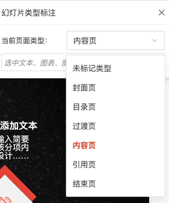

# 文件解释
```
# 示例饿文件
标注过后的pptx.json
未标注pptx.json

# 把未格式化的json格式话
format_json.py

# 网上下载的模版
质感黑红工作报告PPT模板.pptx
质感黑红工作报告PPT模板-单页.pptx
```

# 如何标注数据文档
doc/Template.md

# AI自动化标注探索流程
## 目标
把“上传的 PPTX文件 → 自动生成的普通 JSON”转换为“可复用的 PPT 模版 JSON”。

## 实现步骤
1）启动前端，pptx文件通过前端的页面的导入，转换成json文件


2）Qwen VL对页面进行判断和其中的元素进行判断，属于哪种页面类型，每个元素是哪个元素类型。



3）根据Qwen VL的判断，通过 IoU 把这些框对齐回你的原始 JSON 元素，从前端进行修改元素，或者后端修改元素类型。

4）导出json作为模版。


## 运行的代码
```
输出识别结果到slide0_vis.png
slide0.png是单张pptx文件的截图
未标注pptx.json是slide0.png的前端的识别结果
python qwen_vl_2dgrounding.py \
  --image ./slide0.png \
  --in-json ./未标注pptx.json \
  --out-json ./ai_template_pptx.json \
  --page-index 0 \
  --viz bbox \
  --viz-out ./slide0_vis.png
```
